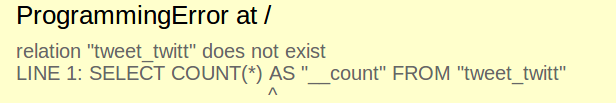
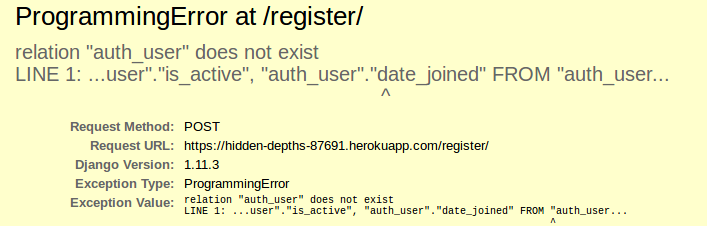
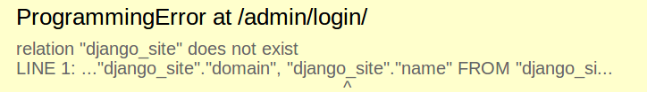

# Errores #

Al desplegar por primera vez en heroku se producen unos errores de programacion
al momento de cargar las plantillas por medio de las vistas, los cuales seran enlistados 
a medida que se encuentren

## Index ##

* **Error:** no se cargan los recursos de la DB, especificamente en la table *tweet_twitt*

* **Razón:** en la vista principal se cargan los **twitt's** de todos los usuarios para mostrarlos, pero al no existir usuarios en la tabla *tweet_twitt* no existen recursos, la tabla almacena la relación de un usuario y un twitt 

* **Posible solución**: 
	* manejar una excepcion o error del contenido mostrado en la vista index cuando se establezca el contenido a mostrar, evitando que se cargue información de una tabla que retorne datos null.
	* Editar plantilla que renderiza información para que muestre los twitt's siempre que no sean nulos.
	
## Registro "Completo" ##

* **Error:** Inconsistencia en DB

* **Razón:** Por analizar

* **Posible solución:** Por analizar

### Dashboard Administración ###

* **Error:** Inconsistencia en DB

* **Razón:** Inconsistencia en DB

* **Posible solución:** Por analizar

**Solucion Errores anteriores**  

* MIGRAR LA BASE DE DATOS 

	* `$ heroku run python manage.py migrate`

## Nuevos Errores ##

Ya solucionado los errores anteriores, se presenta un error en el aplicativo al momento de enviar el email de activación el cual se solucionara localmente y despues se anexara el repositorio